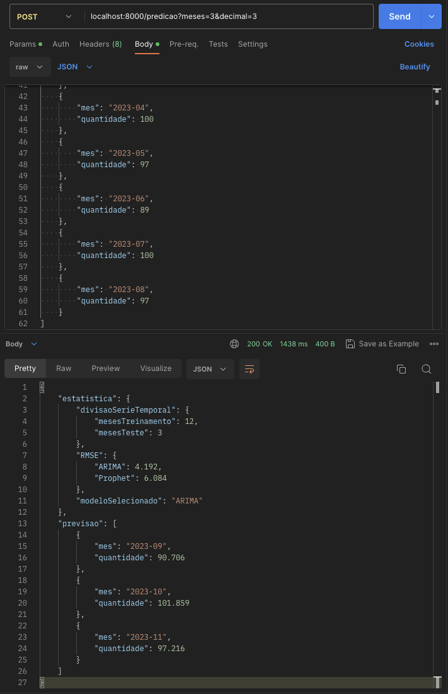

# API de Previsão de Consumo de Medicamentos
A API de Previsão de Consumo de Medicamentos é uma ferramenta poderosa que permite aos usuários obter insights valiosos sobre o consumo futuro de medicamentos com base em dados históricos. Essa API utiliza técnicas avançadas de modelagem de séries temporais em machine learning, mais especificamente os modelos ARIMA (AutoRegressive Integrated Moving Average) e Prophet, para gerar previsões precisas e confiáveis para o consumo de medicamentos nos próximos N meses.

# Recursos e Funcionalidades:
- Previsão de Consumo: Os usuários podem fornecer os dados históricos de consumo de medicamentos por meio de um formato de entrada simples e receber uma previsão detalhada para o consumo nos próximos meses;   
- Precisão: Para cada requisição dois modelos são treinados (ARIMA e Prophet) para obter o melhor para relizar a predição. O algoritmo mais preciso para os dados informados será utilizado para realizar as predições;    
- Adaptação: Caso seja informada uma série histórica maior que 12 meses a API automaticamente irá identificar padrões sazonais para uma predição mais precisa;   
- Personalização: A API permite que os usuários definam a quantidade de meses para a previsão e a quantidade de casas decimais para os valores retornados, adaptando-se às suas necessidades específicas;   
- Consistência: Regras são aplicadas para verificar se o usuário infomou meses duplicados ou algum gap temporal, datas incorretas, campos ausentes ou mal formatados, tudo para manter a maior consistência possível para as predições;   
- Informativa: Parâmetros estatisticos são retornados em conjunto com a predição para dar maior transparência ao processo de criação do modelo e predição;   
- Container Docker: A API foi implementada em um container Docker, o que facilita sua utilização e garante uma implantação simples e rápida em qualquer ambiente compatível com Docker.

# Fluxo de uso:
1. Acesse a API: Acesse a URL fornecida para interagir com a API de Previsão de Consumo de Medicamentos;   
2. Envie os dados: Forneça os dados históricos de consumo de medicamentos no formato adequado, incluindo o mês e a quantidade mensal consumida;   
3. Defina a quantidade de meses e arredondamento: Informe o número de meses para a previsão desejada através dos parâmetros da API em conjunto com o arredondamento desejado para os valores previstos, sendo este último um parâmetro não obrigatório;   
4. Receba a previsão: A API processará as informações fornecidas e retornará uma previsão detalhada para o consumo de medicamentos nos próximos meses;   
5. Análise os resultados: Explore os resultados obtidos e utilize as informações estatisticas e de previsão para tomar decisões embasadas em relação ao consumo de medicamentos.

# Benefícios:
- Tomada de Decisão Informada: Através das previsões geradas pela API, os usuários podem antecipar o consumo futuro de medicamentos, permitindo uma melhor gestão de estoques e planejamento estratégico.   
- Otimização de Recursos: Ao obter previsões precisas, é possível otimizar recursos, evitar desperdícios e garantir um suprimento adequado de medicamentos, contribuindo para a eficiência do sistema de saúde.   
- Flexibilidade e Personalização: A API permite que os usuários personalizem a quantidade de meses para a previsão, adaptando-se às suas necessidades e exigências específicas.   

# Instalação:
A API roda em um container Docker, e dessa forma necessita apenas que o computador do usuário possua o software [Docker](https://docs.docker.com/desktop/install/windows-install/) instalado.   
Uma vez instado o Docker o usuário deverá acessar a pasta raiz do projeto no terminal do computador e digitar:
```
docker build -t "api-predicao-consumo-medicamento" .
```
O comando acima fará com que a imagem do Python seja baixada e as dependências do projeto sejam instaladas no container. Após a criação do container será necessário iniciá-lo, por meio do código abaixo:
```
docker run -p 8000:8000 api-predicao-consumo-medicamento
```
Agora a API já está disponível para utilização.

# Utilização
A API foi desenvolvida seguindo o padrão REST, utilizando o protocolo HTTP.   
## URL
A API está disponível na URL: `localhost:8000`
## Rotas
A API possui duas rotas:
* @GET /status: Retorna um JSON informando se a API está disponível. Utilizada apenas para testar a disponibilidade da mesma;
* @POST /predicao: Recebe um JSON com a série histórica e retorna a predição. Possui dois query params:
    * meses [int/obrigatório]: Quantidade de meses que a API deverá predizer;   
    * decimal [int/não obrigatório]: Arredondamento para os valores preditos de consumo (default = 0).
## JSON
Os dados históicos de dispensação deverão ser informados no seguinte formato:
```
[
    {
        "mes": "2022-06",
        "quantidade": 80
    },
    {
        "mes": "2022-07",
        "quantidade": 88
    },
    {
        "mes": "2022-08",
        "quantidade": 89
    },
    {
        "mes": "2022-09",
        "quantidade": 90
    },
    ...
]
```
## Exemplo cURL
Exemplo de uma requisição para a API:
```
curl --location 'localhost:8000/predicao?meses=2&decimal=1' \
--header 'Content-Type: application/json' \
--data '[
    {
        "mes": "2022-06",
        "quantidade": 80
    },
    {
        "mes": "2022-07",
        "quantidade": 88
    },
    {
        "mes": "2022-08",
        "quantidade": 89
    },
    {
        "mes": "2022-09",
        "quantidade": 90
    },
    {
        "mes": "2022-10",
        "quantidade": 91
    },
    {
        "mes": "2022-11",
        "quantidade": 101
    },
    {
        "mes": "2022-12",
        "quantidade": 89
    },
    {
        "mes": "2023-01",
        "quantidade": 100
    },
    {
        "mes": "2023-02",
        "quantidade": 115
    },
    {
        "mes": "2023-03",
        "quantidade": 103
    },
    {
        "mes": "2023-04",
        "quantidade": 108
    }
]'
```
## Exemplo Postman
Por fim, segue um exemplo de utilização no software Postman.
